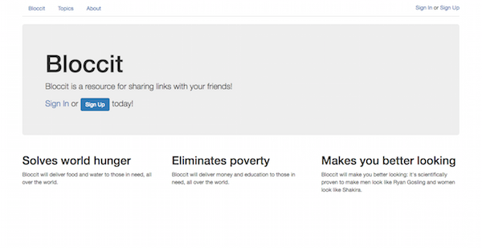

## Bloccit
## A Reddit replica to teach the fundamentals of web development and Rails

Bloccit is an application that lets users read and create posts on an unlimited array of topics. In addition to being able to create posts, signed in users are able to leave comments and up-vote and down-vote comments and posts that they like or dislike. The order that the posts are presented in is calculated by the number of votes as well as the age of the post. Finally, authorized users can create and delete topics, as well as moderate the posts and comments of users.

----
Made with my mentor at [Bloc](http://bloc.io).
